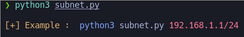
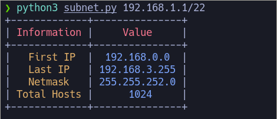

# Subnet

This tool allows us to list the following points:

* First host
* Last host
* Subnet mask
* Total hosts

## How does it work?
======
The execution of the tool is very simple:

    

The utility reports information in tables:

    

